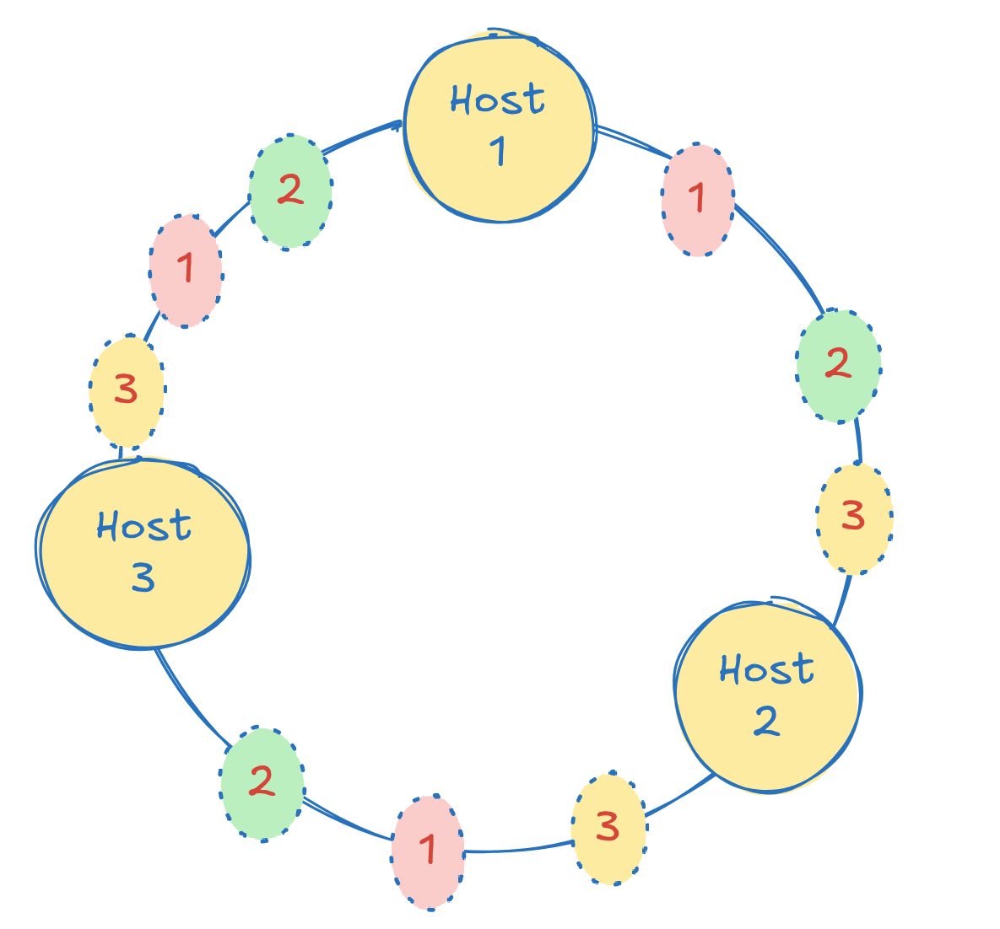

# consistent-hashing

A lightweight and concurrency-safe consistent hashing implementation in Go,
with support for **replication** and **virtual nodes**.

Check this [video](https://www.youtube.com/watch?v=vccwdhfqIrI) to learn about Consistent Hashing.



## Installation

```bash
go get https://github.com/zuzuleinen/consistent-hashing
```

Then use it in your project:

```go
import "github.com/zuzuleinen/consistent-hashing"
```

## Usage 

### Basic usage:

```go
	ch := consistenthashing.NewConsistentHashing()

	ch.Add("host-1")
	ch.Add("host-2")
	ch.Add("host-3")

	matchedHosts, err := ch.Get("customer-id-1")
```

If `ch` is constructed without any options, it will always match exactly one host.

### Enable virtual nodes:

```go
    ch := consistenthashing.NewConsistentHashing(
        consistenthashing.WithVirtualNodes(100),
    )
```

In this case, each primary host receives `100` virtual nodes each. 


### Enable replication:

```go
		ch := consistenthashing.NewConsistentHashing(
			consistenthashing.WithReplicationFactor(2),
		)

        ch.Add("host-1")
        ch.Add("host-2")
        ch.Add("host-3")

        matchedHosts, err := ch.Get("customer-id-1")
```

`WithReplicationFactor` allows you to pass a replication factor `R`. 
When `R > 1` a key will be saved in `R` matchedHosts nodes instead of just one. In our example `len(matchedHosts) == 2`.
When `R` is bigger than the number of primary hosts, it will be capped to nr. of primary hosts.

## Contributing

Feel free to [open an issue](https://github.com/zuzuleinen/consistent-hashing/issues/new) or e-mail me at andrey.boar[at]gmail.com.

If you want to keep in touch, connect with me on [LinkedIn](https://www.linkedin.com/in/andrei-boar/).